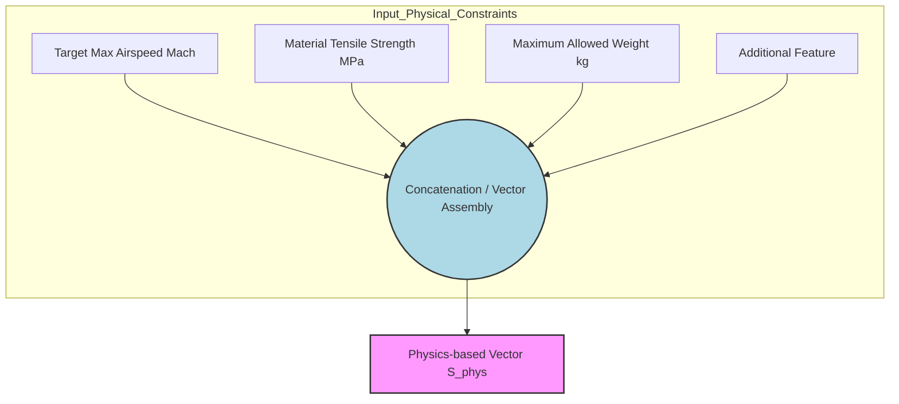

```mermaid
graph TD

    %% --- INPUT PHYSICAL CONSTRAINTS ---
    subgraph Input_Physical_Constraints
        C1[Target Max Airspeed Mach] --> S_phys_concat
        C2[Material Tensile Strength MPa] --> S_phys_concat
        C3[Maximum Allowed Weight kg] --> S_phys_concat
        Cn[Additional Feature] --> S_phys_concat
    end

    S_phys_concat((Concatenation / Vector Assembly)) --> S_phys_dense[Physics-based Vector S_phys]

    style S_phys_dense fill:#f9f,stroke:#333,stroke-width:2px
    style S_phys_concat fill:#add8e6,stroke:#333,stroke-width:2px
```

